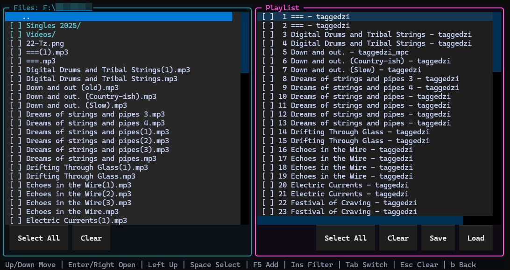

# RhythmSlicer Pro


RhythmSlicer Pro is a cross-platform CLI + Textual TUI music player with
playlist management and built-in ASCII visualizers powered by the VLC backend.




## Requirements

- Python 3.9+
- VLC installed (RhythmSlicer uses VLC via `python-vlc` for playback)

## Platform prerequisites

- VLC installed and available on your system.
- `python-vlc` is installed automatically with this project.

## Install

Windows (PowerShell):

```powershell
python -m venv .venv
.\.venv\Scripts\Activate.ps1
pip install -e .
```

Linux/macOS (bash):

```bash
python -m venv .venv
source .venv/bin/activate
pip install -e .
```

## Run

```bash
r-slicer
```

## Development

```bash
pip install nox
nox -s lint-fix
nox -s lint
nox -s tests
nox -s build
nox -s coverage
```

## CLI options

```bash
r-slicer
```

## Usage

- Press `?` for Help to see keybinds and usage.
- Playlist basics:
  - Open a folder or playlist via the in-app prompt.
  - Navigate with arrow keys; press Enter to play.
  - Save playlists as `.m3u8` from the TUI.

## Troubleshooting

Logs are always-on and stored in:

- Windows: `%LOCALAPPDATA%/RhythmSlicer/logs/app.log`
- Linux/macOS: `~/.rhythm_slicer/logs/app.log`

If the app freezes, the watchdog writes stack traces to:

- Windows: `%LOCALAPPDATA%/RhythmSlicer/logs/hangdump.log`
- Linux/macOS: `~/.rhythm_slicer/logs/hangdump.log`

When opening a GitHub issue, please attach both `app.log` and `hangdump.log`.

### VLC backend not found (Windows)

If you see errors like `VLC backend is unavailable` or `libvlc.dll` cannot be
loaded, ensure VLC and Python bitness match (both 64-bit), then set the VLC
paths for your terminal session:

```powershell
$env:VLC_DIR = "C:\Program Files\VideoLAN\VLC"
$env:PATH = "$env:VLC_DIR;$env:PATH"
$env:PYTHON_VLC_MODULE_PATH = $env:VLC_DIR
$env:PYTHON_VLC_LIB_PATH = "$env:VLC_DIR\libvlc.dll"
python -c "import vlc; print(vlc.libvlc_get_version())"
```

If that prints a version (e.g., `3.0.21 Vetinari`), the backend is available.
If it fails, verify `libvlc.dll` exists at the path and that VLC is installed.

## AI Assistance

Portions of this project were drafted with help from AI tools (such as ChatGPT/Codex) to accelerate writing and implementation. Maintainers review, test, and accept the final output, so accountability for released code and docs stays with the project.
